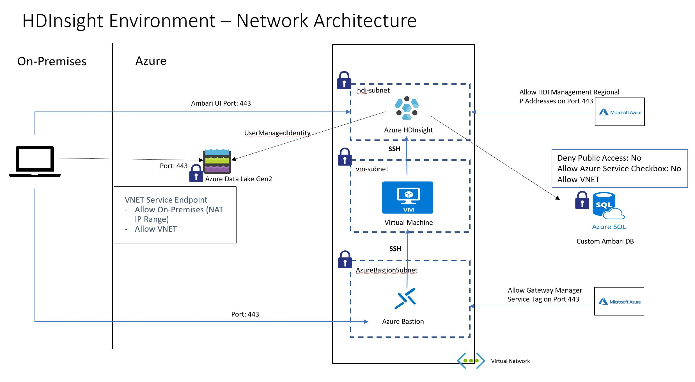

Sample scripts to create and HDInsight environment as shown in the following architecture diagram.

**Note**: Please refer to my medium post [**Provisioning Azure HDInsight Environment with Strong Network Controls**](https://medium.com/@isinghrana/provisioning-azure-hdinsight-environment-with-strong-network-controls-a631dcf3a125) to get better context on the reasoning behding this architecture.

**Environment Creation**
1. Download Terraform - https://www.terraform.io/
2. Download the folder/repo to local machine
3. Download Azure CLI - https://docs.microsoft.com/en-us/cli/azure/install-azure-cli?view=azure-cli-latest
4. Go over the *variable.tf* file and update the values as per your environment, the file itself has instructions in the comments
5. On a Terminal go to the *hdinsight* folder 
6. Run the command *az login*
7. Run the command *az account set -s <subscriptionid or name>* (Optional - only if you have multiple subscriptions and you want to use non-default Azure Subscription)
7. Run the command *terraform init*
8. Run the command *terraform apply* to create the environment

It takes about 30-40 minutes to provision this environment. A total to 2 Resource Groups are created, one for Azure HInsight cluster and the other for pre-requiste resources needed by Azure HDInsight.

Following resources are created as part of these scripts
- Azure VNET with Subnets and NSGs
- Azure Virtual Machine with Network Interface Card
- Azure Bastion with Public IP
- Azure HDInsight Cluster with Load Balancers, Public IP, Network Interface Cards, etc.
- Azure SQL Database with logical server
- Azure Data Lake Gen2 (storage account)
- User Managed Identity for Azure HDInsight

**Environment Deletion**

These resources will cost a few dollars per hour so do remember to delete the environment. To delete the environment run the command *terraform destroy*. There is a known issue where deletion could fail, just re-run the command and it should work the second time. I have it on my list to investigate fix for this issue.

**Azure ARM Template for HDInsight**

You will notice that the actual HDInsight is provisioned using Azure ARM Template rather than Terraform and this is because currently Terraform HDInsight Spark resource does not allow provisioning cluster with external metastore. This is also the reason for creating HDInsight clsuter in a separate resource group, as per the documentation [azurerm_template_deployment](https://www.terraform.io/docs/providers/azurerm/r/template_deployment.html) its better to create resources from ARM Template in a separate Resource Group.

**Other Notes**
- Creating multiple HDInsight clusters in the same Virtual Network requires first 6 characters of the cluster name are unique.
- Password for HDInsight must be at least 10 characters in length and must contain at least one digit, one uppercase and one lower case letter, one non-alphanumeric character (except characters ' " ` )