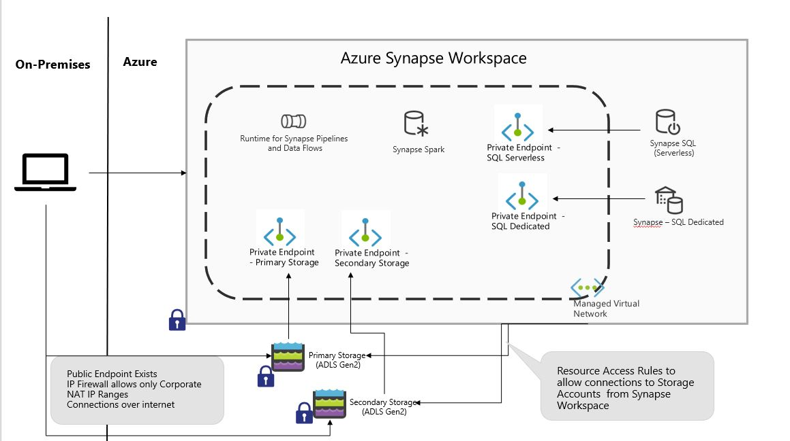

## Azure Synapse Workspace Environment Creation Scripts 
***

These are the companion scripts my medium blog post  [**XXXXX**](https://medium.com/@isinghrana/XxXXX) so please read the blog post for better context on the key considerations for the architecture.

The scripts are mix of ARM Templates and few powershell scripts because everything is not available using ARM Templates at this time (please do note some of the preview features are used). The following diagram shows the architecture of the environment created by the scripts.

***

### Pre-Requisites
1. Make sure you have Powershell 7 or later installed - https://docs.microsoft.com/en-us/powershell/scripting/install/installing-powershell-core-on-windows?view=powershell-7.1 . Powershell 7 is avilable for Mac and Linux as well but my testing has only been on Windows
2. Make sure you have Azure Powershell 6.4.0 or later installed (these are Az Powershell modules) - https://docs.microsoft.com/en-us/powershell/azure/?view=azps-6.4.0 
3. Azure Synapse Powershell modules are in Preview and not part of the Azure Powershell install so you will need to explicitly install Azure Syanpse Powershell Module using the command *Install-Module -Name Az.Synapse* as documented on the Install Azure Syanpse Powershell module section on the public docs - https://docs.microsoft.com/en-us/azure/synapse-analytics/quickstart-create-workspace-powershell 
4. Permissions for user account used to run the scripts
    - ARM templates grant Azure Synapse Workspace Managed Identity Storage Blob Data Contributor permissions on the Default Storage Account so user running the scripts will need to be Owner or User Access Administrator at the Subscription Level (Contributor role does not have permissions to make role assignments).
	- If that's too permissive it is possible to get a Resource Group pre-created and get Owner or User Access Administrator permissions at the Resource Group level, the *deploy.ps1* script generates the Resource Group Name based on *prefix* parameter in ARM Template Parameter file so get Resource Group created with appropriat name. Example - If prefix is *isrsyn1* then resource group name should be *isrsyn1-rg*. Run the deployment script once the Resource Group created with appropriate name and it will use the existing Resource Group.

***

### Environment Creation

1. Download the folder/repo to local machine
4. Go over the *azuredeploy.param.json* file and specify the parameter values as per your environment, the file itself has instructions in the comments
5. On Powershell window go to the *synapse* folder 
6. Sign in to your Azure account using the commandlet *Connect-AzAccount* (see the public docs [here](https://docs.microsoft.com/en-us/powershell/azure/authenticate-azureps?view=azps-6.4.0) if new to Azure)
7. Set the context to the desired Subscription if you have access to multiple Subscripition using *Set-AzContext* Commandlet (public docs [here](https://docs.microsoft.com/en-us/powershell/module/az.accounts/set-azcontext?view=azps-6.4.0#examples))
7. Run the command *./depoy.ps1*

It takes about 5-10 minutes to provision this environment. 

***

### Resources Created

Following resources are created as part of these scripts
- Resource Group for all the resources (please see the pre-req section for an exception that Resource Group can be pre-created)
- Azure Syanspe Workspace 
  - SQL Dedicated Pool inside Syanpse workspace
  - Synapse Spark Pool  
- Primary Storage Account (ADLS Gen2)
- Secondary Storage Account (ADLS Gen2)
Please see the more details on the medium blog post.

***

### Next Steps
Don’t forget to Assign end users permissions on the Storage Account, even the user account which creates the Synapse Workspace is not setup with Data Plane access on the Storage Account for Synapse Storage Browser to work
* RBAC - https://docs.microsoft.com/en-us/azure/storage/blobs/assign-azure-role-data-access?tabs=powershell
* ACL - https://docs.microsoft.com/en-us/azure/storage/blobs/data-lake-storage-access-control#how-to-set-acls

***

### Environment Deletion

Please do note that there will be costs associated with the resources created using these scripts. It would be a good idea to pause SQL Dedicated Pool when not using it, costs for other components should be pretty minimal. Please see the pricing page for detailed costs of Azure Synapse components - https://azure.microsoft.com/en-us/pricing/details/synapse-analytics/

